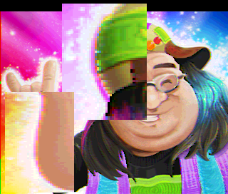

I want to share some of my recent findings when having fun with a very old and not really known graphics mode from the 80s called "HAM". Everything started when I wanted to add HAM support in the bitmap converter tool I made to create my oldskool demos.

## The challenge
Nowadays you don't even notice when looking at photos in your web browser. But back in time, displaying a "realistic" image on screen was really a challenge. So let's say you want to display this nice 16 million colors picture (24bits) on your old Amiga 500 computer.

*Original: No palette, 24bits depth*

_Image courtesy of Farfar/lns_

The "off the shelves" Amiga could only display 32 simultaneous colors picked from a 12bits (4096 colors) palette. So if you convert this picture to 32 colors using any PC tool you'll probably get that:

*32 colors palette, 12bits depth*


This doesn't look great right? A palette of 32 colors is just not enough to display this kind of colorful image.

## What is HAM?
HAM stands for "Hold And Modify" and is a really tricky video mode introduced by Commodore on their famous Amiga machine. Amiga engineers were ahead of time when they designed this mode. Standard video mode is palette indexed only. That is, a pixel is a 5bits index over a 32color palette. 
On Amiga, a pixel index could be up to 6 bits. Commodore could have said "ok let's add another classic 64 colors mode using our 6bits pixel index". But they took the more challenging path by introducing the HAM mode.
In HAM mode, each pixel needs 6 bits of data. From these 6 bits, 2 of them represent a HAM Code (0 to 3), and 4 a palette index (0 to 15). And here is the magic:

| HAM code | Meaning during image decoding |
|:-|:-|
| 00 | Use following 4bits to index the 16 colors palette (as a classic mode) |
| 01 | Use following 4bits to replace the Blue component of current color |
| 10 | Use following 4bits to replace the Red component of current color |
| 11 | Use following 4bits to replace the Green component of current color |

The magic (and also very tricky) is that it's "almost" a no palette mode. Of course you can't set any pixel to any RGB color in one go, but you can change any color component of the next pixel. ( R, G or B )

## Color Distance

Everything in the converter will rely on a "color distance" function, that should tell us how close a color is from the original pixel. In the converter, the input image has already been converted to 12bits ( RGB444 ), using Sierra dithering during this quantization process. So we need that kind of function:

```c
int	ColorDistance(Color444 colorA, Color444 colorB)
{
	int dr = abs(colorA.GetR() - colorB.GetR());
	int dg = abs(colorA.GetG() - colorB.GetG());
	int db = abs(colorA.GetB() - colorB.GetB());
	dr *= dr;
	dg *= dg;
	db *= db;
	// empirical "perceptual" ratio
	return dr * 3 + dg * 4 + db * 2;  	// avoid final square root, as is doesn't change the compare order
}
```

There is tons of literature about "perceptual" colors calculation (1). The problem is that everything you can find on the internet is dealing with 24bits or more colors. In our low end 12bits field, with only 16 levels of shade, it's even hard to talk about sRGB or linear color space. I did plenty of tests, and the best empirical results are with 3,4,2 ratio for RGB.


## First fast version of the HAM converter
So I wanted to give it a try and convert some images to this mode. My naive converter just used this algorithm. At the start of each line, I set current_color to black. Then, for each pixel of the line, I try all 16 possible values of R, all 16 values of G and 16 values of B. That is 48 iterations only ( because HAM can only change one component at a time, R, G or B ). For these 48 possibilities, I keep the closest one to the original pixel color, using the color distance function.
So far so good, it runs immediately on modern PC and produced that kind of awesome image:

*HAM 12bits, no palette use*


With almost no effort we can display that kind of colorful image on a 1985 computer. Isn't that impressive? HAM engineers had a wonderful idea back in time.

## Color artefacts

But our HAM journey isn't over. If you look closely at the image, there are plenty of color artefacts. 



This HAM image doesn't use the 16 entries palette at all ( all palette is black ). It's only using the ability to change R, G or B per pixel. If you look closely, the image is full of bad color artefacts. Looks like an old VHS on a NTSC monitor :) These artefacts are easy to understand.  
So let's imagine you have a high contrast zone in an image. Like you have plenty of black pixels on a line, and in the middle of the line, all pixels become white. If you're using HAM codes only (ie modifying R, G or B), you'll need up to 3 pixels to go to white. 

| original | black(000) | black(000) | white(111) | white(111) | white(111) |
| HAM code |  |  | Set R | Set G | Set B |  |  |
| output | black(000) | black(000) | **Red(100)** | **Yellow(110)** | white(111) | white(111) |

You will see some colourful artefacts when some drastic RGB change are required

Instead of having these pixels


You got that...


## Problem to solve

That's why HAM also has a fixed 16 colors palette. If I had "white" in this small palette, I could use it to immediately switch from black (0,0,0) to white (1,1,1), and avoid the wrong red and yellow pixel of the previous exemple.

| original | black(000) | black(000) | white(111) | white(111) | white(111) |
| HAM code |  |  | use color index 1 |  |  |  |  |
| output | black(000) | black(000) | white(111) | white(111) | white(111) | white(111) |

So the idea is simple: if we want to get rid of color artefacts, we have to carefully select 16 colors in our palette to minimise the artefacts on the final image. But how to do that?  
Of course we could use any classic color reduction algorithm such as NeuQuant (2) to get a 16 colors palette from the original image, and try to build a HAM picture with that. But why would a classic color reduction algorithm fit the specific HAM constraint? Like, maybe HAM needs a color that is slightly off the original image (or even doesn't exist) to help during image encoding. 

So let's say I have a 16 colors palette. I can change my "find best HAM scanline" code adding 16 more iterations. First, I keep testing all 16 possible R changes, G and B. And then, I try to find an even better solution using the current palette. (it's important to test in that order, because if two solutions have the same error, better take the HAM one, to not waste a precious palette entry)  
It means 64 color distances to compute, and keep the best one. It still runs immediately on PC. I can also walk the complete image and produce an error score. More HAM pixels are off from the original image, greater is the error.

Basically I could have one simple function like this:

```c
int ComputeHAMError( const Bitmap& original, const Color palette[16] )
```

So you can compute the overall error on the image when HAM encoding using a given palette. But how to create the optimal palette to have the smallest possible error?

## Brute force is sometimes magic

I'm supposed to be the optimizer guy. And I'm talking about brute force, you might laugh. Sometimes brute force has magic properties: as it walks the entire solution field, you may get the optimal solution of your problem. Obviously this is only valid if you can browse the entire solution field in a reasonable time. And for this specific problem, I don't care about the processing time as it's an offline process. Once the HAM data is generated, I can display it on the Amiga for free. 

Amiga has 12bits color depth so any entry in the palette is a 12bits number (4096 possible values). What if we try all possible values for each palette entry? As palette entries are independent (you can swap entries without changing the result) there aren't so many possibilities. And we have powerful PC to produce data for very low end Amiga right?

So the main brute force loop looks like this pseudo code:

```c
	Color444 palette[16];
	// Loop through the 16 entries of the palette to build, one by one
	for (int palIndex = 0; palIndex < 16; palIndex++)
	{
		int bestError = MAX_ERROR;
		Color444 bestColor = 0;
		// then for each entry, try ALL possible Amiga colors, and compute a global image error when using this temporary palette
		for (Color444 bruteColor = 0; bruteColor < 4096; bruteColor++)
		{
			palette[palIndex] = bruteColor;
			int err = ComputeHAMError(bitmap, palette);	// Compute a global image error with current palette
			if (err < bestError)
			{
				bestColor = bruteColor;		// keep tracking the best color for the current palette entry
				bestError = err;
			}
		}
		// store the best color for this palette entry, and then continue with the next entry
		palette[palIndex] = bestColor;  // write final best color for this pal entry
	}
```

ComputeHAMError function is calculating the best HAM image, using a palette as input. It also returns a error score that we try to minimize. So this function was immediate when we called it a single time, but now we have to call it 16*4096 times, so our tool will just run 65536 times slower! 

Let's see how it runs. Palette entries are walked one by one, and you can see how the overall image quality increases when adding colors to the HAM palette.

_note: this is animated PNG file, I hope your browser supports it_


So to compare results, here is an animation with the original 24bits image, then a temp unlimited colors but 12bits depth image, with dithering. And finally the HAM version of it, that could be displayed on a 1985 Amiga machine! Not so bad heh?

_Final comparaison: 24bits original, 12bits convert with dithering, and HAM version compatible with 1985 Amiga_


_Same three images compare with another picture_


## What if more palettes?

Having a good 16 colors palette helps a lot for image quality. But having just 16 colors to avoid plenty of artefacts is not our best option. On the Amiga, there is a co-processor called "Copper" that could change the current palette in the middle of the screen. What if we're able to change the 16 colors palette in each scanline? In the Amiga world this is often referred as "Sliced HAM", or SHAM. 

Instead of brute-forcing one 1 palette over 320x256 pixels, let's try to brute-force 256 palettes over 320x1 pixels ( 1 palette per line ).

_Please note brute force SHAM takes the same amount of time as HAM, because we're calling FindBestPixel the exact same amount of time_

Here is the result, the quality improvement is big!


## State of the Art

And now what about breaking the 4096 colors (12bits) limit of the Amiga? We have 16 levels of shade only ( 0 to 15 ). Let's suppose we flip the shade level of a pixel between 5 and 6, each frame ( 50hz ). We may see some flickering, but our eye will see kinda "in between" shade levels.

So instead of 16 levels of shade we now have 31 levels. It means 29791 possible colors instead of 4096!


Let's have a try with our best looking mode SHAM. Algorithm is: Quantize 24bits (888) image to 15bits (555). Then, split this 15bits image into two 12bits images (444). And now just encode these two 444 images in SHAM! On the Amiga, flip these two SHAM images at 50hz. Let's call this state of the art 5bits mode "SHAM5b"

And here is the result: SHAM vs SHAM5b. **It almost looks like a 24bits image, and it runs on 1985 machine!**


_Note: the SHAM5b displayed here is a combination of the two SHAM pictures, because we can't really flicker at 50hz on this website._

If some of you are interested, here is an Amiga floppy disk image you can run on real hardware or any emulator.
When you run this Amiga disk, the standard HAM image is displayed. If you keep the left mouse button pressed, then the SHAM image is displayed (so you can quickly switch to get the improvement). And if you press the right mouse button, the SHAM5b full quality image is displayed.

[Download SHAM5b Amiga Executable Disk Image](https://arnaud-carre.github.io/assets/img/ham/sham5b.zip)

## Optimization

I'm doing my tests on a AMD Ryzen 7 2700X, 8 cores (16 threads ). And the first version is producing a 320*256 pixels Amiga HAM image in…. **8 minutes and 37 seconds**. Wow. I'm sure you know plenty of faster HAM converters, but they probably don't scan the complete solution field.
However, 8m to proceed with a low res image on modern hardware is not really satisfying (even if we scan the entire solution field). to me the real fun part of the job starts now: optimizing!

Basically, the outer loop is 65536 iterations ( 16 palette entries to fill, with 4096 possible colors each ). Then we call FindBestPixel for each of the 320*256 pixels of the picture. Finally, in FindBestPixel, we're computing 64 color distances ( 16 possibilities to change R, 16 for G, 16 for B and finally 16 possibilities to index into the HAM palette )

As I knew this ColorDistance function will be called **a lot**, I already optimize it a bit using small lookup tables. So 8m37s version is already using that kind of function:

```c
ColorError_t	Distance(const Color444& rv) const
{
	const int idxR = (GetR() << 4) | rv.GetR();
	const int idxG = (GetG() << 4) | rv.GetG();
	const int idxB = (GetB() << 4) | rv.GetB();
	return LazyTables::distR[idxR] + LazyTables::distG[idxG] + LazyTables::distB[idxB];
}
```
Pretty simple, I have three small lookup tables of 256 entries each that contains proper weighted distance between any two 4bits shade values. ( one table for R, G and B )

And the main "per pixel" function is looking like this:


Color444	BruteForceHam::findBestPixel(const Color444& original, const Color444& previous, ColorError_t& errOut, const AmigaColor* pal, int palSize, HamPixelState& state) const
{
	ColorError_t err = kColorErrorMax;
	Color444 newPixel;
	Color444 sc;
	// brute force all R
	for (int v = 0; v < 16; v++)
	{
		sc = previous;
		sc.SetR4(v);
		ColorError_t d = original.Distance(sc);
		if (d < err)
		{
			state.hamCode = 2;		// R ham code is 10
			state.hamIndex = v;
			newPixel = sc;
			err = d;
		}
	}
	// same 16 iterations loop for G
	// same 16 iterations loop for B
	// same 16 iterations loop for palette search
	errOut = err;
	return newPixel;
}


At line 10 and 11 that we overwrite the R component with our searching value, and then we compute the distance with the original pixel. The Distance function is supposed to be fast, but it still doing a lot of things: Extract RGB component of two Color444, and then read from 3 lookup tables.
Here is a simple improvement: When we're trying all possibilities for R, the G and B color distances are constant! So why first computing the G and B distance outside of the loop, and then only fetch the R lookup table? Let's try, the new version looks like that:


// brute force all R
{
	ColorError_t distGB = Color444::DistanceG(original.GetG(), previous.GetG()) + Color444::DistanceB(original.GetB(), previous.GetB());
	for (int v = 0; v < 16; v++)
	{
		ColorError_t d = distGB + Color444::DistanceR(original.GetR(), v);
		if (d < err)
		{
			state.hamCode = 2;		// R ham code is 10
			state.hamIndex = v;
			newPixel = previous;
			newPixel.SetR4(v);
			err = d;
		}
	}
}


_Note: at line 6 we're calling DistanceR, that is only fetching from 1 lookup table. Also we now only call SetR4 in case of a better pixel_

New score: **4 minutes and 36 sec**! Almost two times faster, nice


What could we improve now? there are 64 conditional branches executed per pixel ( if (d < err) ). Modern CPU use really smart branch predictors (3) but maybe we could improve things by removing the branch. 
What if we could use a conditional mov? ( cmov ). Right now, if the branch is not taken, we have to set state.hamCode, state.hamIndex and newPixel. If we could compute newPixel at the very end of the function, using the hamCode, we may use a conditional move by storing the hamcode **in** the distance! Like, let's say we put the hamcode in the lowest 6bits of err. We could try to make the compiler generate a conditional mov by using that kind of C:


int distGB = Color444::DistanceG(original.GetG(), previous.GetG()) + Color444::DistanceB(original.GetB(), previous.GetB());
const int* tabR = LazyTables::distR + (original.GetR() << 4);
for (int v = 0; v < 16; v++)
{
	unsigned int d = distGB + *tabR++;
	d = (d<<6) | ((2 << 4) | v);	// R ham code is 10
	err = (d < err) ? d : err;
}

_Note: Line 7 should generate a conditional mov instruction now instead of a branch

Woow what a surprise! The code is now running in **2 minutes and 47 seconds**! Let's check the assembly code if the compiler properly generated conditional mov instead of conditional branch:


00007FF755953C10:
		movdqu      xmm1,xmmword ptr [r10]  
		lea         eax,[rcx+4]  
		movd        xmm0,ecx  
		lea         r10,[r10+20h]  
		paddd       xmm1,xmm4  
		pshufd      xmm0,xmm0,0  
		pslld       xmm1,xmm6  
		paddd       xmm0,xmm5  
		add         ecx,r15d  
		por         xmm1,xmm0  
		movd        xmm0,eax  
		pshufd      xmm0,xmm0,0  
		por         xmm1,xmm7  
		pminud      xmm2,xmm1  
		paddd       xmm0,xmm5  
		movdqu      xmm1,xmmword ptr [r10-10h]  
		paddd       xmm1,xmm4  
		pslld       xmm1,xmm6  
		por         xmm1,xmm0  
		por         xmm1,xmm7  
		pminud      xmm3,xmm1  
		cmp         ecx,10h  
		jl          BruteForceHam::findBestPixel+0E0h (07FF755953C10h)  


Wow it’s WAY better than I was expecting at first! Removing the conditional branch also triggered the compiler auto-vectorization!

Look at that beauty: The original 16 iterations loop is now a 2 times unrolled loop, testing 4 colors at a time using 128bits SIMD register (keeping the lowest value thanks to pminud line 15 and 22). This code is looping 2 times ( ecx goes from 0 to 16 with increment by 8 in r15d line 10)

To be honest, auto-vectorizing this small C loop is really a beauty. (see how it reads 4 consecutive values in DistanceR lookup table line 2 and 17)

## Multi Threading

Now we went from **8m37s** to **2m47s** ( 3 times faster ) just by modifying few lines of C, why not using all my CPU cores?

As a rule of thumb when you try to optimize something, **always** profile your code (even a simple time print at the end is enough to try several optimizations). And please, do **not** start multi-threading before you're pretty happy with your single thread version. 

Also, a good advice is to keep an easy way to switch back to the single thread version. (make things easier to debug, to test new ideas, etc)

So our HAM brute force algorithm is suited for multi-threading. High level code loop is:

```c
for (int palEntry=0;palEntry<16;palEntry++)
  for (int bruteColor=0;bruteColor<4096;bruteColor++)
    palette[palEntry] = bruteColor;
    Err = ComputeHAMErrorOnWholeImage( palette )
```

The palette entries should be searched one by one. ( when we're brute forcing palette entry 6, palette entries 0,1,2,3,4 and 5 are supposed to have been already brute forced, and fixed )
So basically the high level loop of MT version will look like:

```c
void threadMain(Color444* palette, int palEntry, int bruteStart, int bruteStop)
{
  for (int bruteColor=bruteStart;bruteColor<bruteStop;bruteColor++)
    palette[palEntry] = bruteColor;
    Err = ComputeHAMErrorOnWholeImage( palette )
}

for (int palEntry=0;palEntry<16;palEntry++)
  Setup a bruteColor start and end per thread
  Run N threads, each one with its own start/stop bruteColor
  wait for all threads to finish
  walk N thread results to keep the best one
  go to next palette entry
```

And the result on my 8cores, 16 threads AMD CPU is... **17 seconds**!

## Conclusion

Having fun doing some old skool stuff often ends in digging into modern optimization. We had fun looking at colourful pixels, and also went from **8m37s** to **17s**

Is there anything we could improve? Sure! I didn't spend so much time on optimising the code so there is a high chance some great optimizations are still missing.

Also regarding the HAM final quality. We use brute force so we're supposed to have the best possible result. But keep in mind everything just relies on the ColorDistance function. And this function is not perfect. Like, maybe we could do all calculations in linear space, maybe we should use a proper (but slower) distance function such as CIELAB. Plenty of things to explore!

This code is part of my abc2 tool ( AmigAtari Bitmap Converter ). And I just released [the source code on Github](https://github.com/arnaud-carre/abc) so you can enjoy!

## Links

<a href="https://twitter.com/leonard_coder" target="_blank">Follow me on Twitter</a>

(1) [https://en.wikipedia.org/wiki/Color_difference](https://en.wikipedia.org/wiki/Color_difference)

(2) [https://scientificgems.wordpress.com/stuff/neuquant-fast-high-quality-image-quantization/](https://scientificgems.wordpress.com/stuff/neuquant-fast-high-quality-image-quantization/)

(3) [https://danluu.com/branch-prediction/](https://danluu.com/branch-prediction/)
