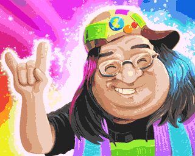
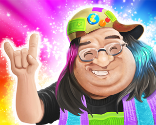
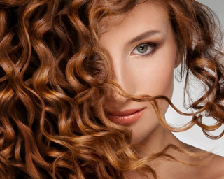

## Introduction
I wanted to create my blog for a while but never took time. 
For a living I'm currently a graphics engineer at Unity, mostly working with modern hardware and GPU. In my spare time I still enjoy programming demo effects or tools for retro computers such as Atari ST and Amiga 500. I think these two worlds (retro & modern) have a lot in common. Modern techniques could be applied efficiently in the retro world, and vice versa. This is what I want to focus on in my blog. As a start, I want to share some of my recent findings when having fun with a very old and not really known graphics mode from 80 called "HAM". I wanted to add HAM support in my bitmap converter tool I'm using for all my demos.

## The challenge
Nowadays you don't even notice when looking at photos in your web browser. But back in time, displaying a "realistic" image on screen was really a challenge. So let's say you want to display this nice 16 million colors picture (24bits) on your old Amiga 500 computer.

*Original: No palette, 24bits depth*


Basic Amiga could only use 32 colors, chosen from a 12bits depth palette only (4096 colors). So if you convert this picture to 32 colors using any PC tool you'll probably get that:

*32 colors palette, 12bits depth*


This doesn't look great right? A palette of 32 colors is just not enough to display this kind of colorfull image.

## What is HAM?
HAM stands for "Hold And Modify" and is a really tricky video mode introduced by Commodore on their famous Amiga machine. Amiga engineers were ahead of time when they designed this mode. Standard video mode is palette indexed only. That is, a pixel is a 5bits index over a 32color palette. 
On Amiga, a pixel index could be up to 6 bits. Commodore could have said "ok let's add another classic 64 colors mode using our 6bits pixel index". But they took the more challenging path by introducing the HAM mode.
In HAM mode, each pixel needs 6 bits of data. From these 6 bits, 2 of them represent a HAM Code (0 to 3), and 4 a palette index (0 to 15). And here is the magic:

| HAM code | Meaning during image decoding |
|:-|:-|
| 00 | Use following 4bits to index the 16 colors palette (as a classic mode) |
| 01 | Use following 4bits to replace the Blue component of current color |
| 10 | Use following 4bits to replace the Red component of current color |
| 11 | Use following 4bits to replace the Green component of current color |

The magic (and also very tricky) is that it's "almost" a no palette mode. Of course you can't set any pixel to any RGB color in one go, but you can change any color component of the next pixel. ( R, G or B )

## First fast version of the HAM converter
So I wanted to give it a try and convert some images to this mode. My naive converter just used this algorithm. At the start of each line, I set current_color to black. Then, for each pixel of the line, I try all 16 possible values of R, all 16 values of G and 16 values of B. That is 48 iterations only ( because HAM can only change one component at a time, R, G or B ). For these 48 possibilities, I keep the closest one to the original pixel color. ( using a color distance function, some talk about that at the end).
So far so good, it runs immediately on modern PC and produced that kind of awesome image:

*HAM 12bits, no palette use*


With almost no effort we can display that kind of colorful image on a 1985 computer. Isn't that impressive? HAM engineers had a wonderful idea back in time.

## Color artefacts

But our HAM journey isn't over. If you look closely at the image, there are plenty of color artefacts. 


This HAM image doesn't use the 16 entries palette at all ( all palette is black ). It's only using the ability to change R, G or B per pixel. If you look closely, the image is full of bad color artefacts. Looks like an old VHS on a NTSC monitor :) These artefacts are easy to understand.  
So let's imagine you have a high contrast zone in an image. Like you have plenty of black pixels on a line, and in the middle of the line, all pixels become white. If you're using HAM codes only (ie modifying R, G or B), you'll need up to 3 pixels to go to white. 

| original | black(000) | black(000) | white(111) | white(111) | white(111) |
| HAM code |  |  | Set R | Set G | Set B |  |  |
| output | black(000) | black(000) | **Red(100)** | **Yellow(110)** | white(111) | white(111) |

You will see some colourful artefacts when some drastic RGB change are required

Instead of having these pixels


You got that...


## Problem to solve

That's why HAM also has a fixed 16 colors palette. If I had "white" in this small palette, I could use it to immediately switch from black (0,0,0) to white (1,1,1), and avoid the wrong red and yellow pixel of the previous exemple.

| original | black(000) | black(000) | white(111) | white(111) | white(111) |
| HAM code |  |  | use color index 1 |  |  |  |  |
| output | black(000) | black(000) | white(111) | white(111) | white(111) | white(111) |

So the idea is simple: if we want to get rid of color artefacts, we have to carefully select 16 colors in our palette to minimise the artefacts on the final image. But how to do that?  
Of course we could use any classic color reduction algorithm ( 
<a href="https://scientificgems.wordpress.com/stuff/neuquant-fast-high-quality-image-quantization/" target="_blank">such as NeuQuant</a> ) to get a 16 colors palette from the original image, and try to build a HAM picture with that. But why would a classic color reduction algorithm fit the specific HAM constraint? Like, maybe HAM needs a color that is slightly off the original image (or even doesn't exist) to help during image encoding. 

So let's say I have a 16 colors palette. I can change my "find best HAM scanline" code adding 16 more iterations. First, I'm testing the 16 colors in the palette. Then I test all 16 possible R changes, G and B. It means 64 color distances to compute, and keep the best one. It still runs immediately on PC. I can also walk the complete image and produce an error score. More HAM pixels are off from the original image, greater is the error.

Basically I could have one simple function like this:

```c
int ComputeHAMError( const Bitmap& original, const Color palette[16] )
```

So you can compute the overall error on the image when HAM encoding using a given palette. But how to create the optimal palette to have the smallest possible error?

## Brute force is sometimes magic

I'm supposed to be the optimizer guy. And I'm talking about brute force, you might laugh. Sometimes brute force has magic properties: as it walks the entire solution field, you may get the optimal solution of your problem. Obviously this is only valid if you can browse the entire solution field in a reasonable time. And for this specific problem, I don't care about the processing time as it's an offline process. Once the HAM data is generated, I can display it on the Amiga for free. 

Amiga has 12bits color depth so any entry in the palette is a 12bits number (4096 possible values). What if we try all possible values for each palette entry? As palette entries are independent (you can swap entries without changing the result) there aren't so many possibilities. And we have powerful PC to produce data for very low end Amiga right?

So the main brute force loop looks like this pseudo code:

```c
	Color444 palette[16];
	// Loop through the 16 entries of the palette to build, one by one
	for (int palIndex = 0; palIndex < 16; palIndex++)
	{
		int bestError = MAX_ERROR;
		Color444 bestColor = 0;
		// then for each entry, try ALL possible Amiga colors, and compute a global image error when using this temporary palette
		for (Color444 bruteColor = 0; bruteColor < 4096; bruteColor++)
		{
			palette[palIndex] = bruteColor;
			int err = ComputeHAMError(bitmap, palette);	// Compute a global image error with current palette
			if (err < bestError)
			{
				bestColor = bruteColor;		// keep tracking the best color for the current palette entry
				bestError = err;
			}
		}
		// store the best color for this palette entry, and then continue with the next entry
		palette[palIndex] = bestColor;  // write final best color for this pal entry
	}
```

ComputeHAMError function is calculating the best HAM image, using a palette as input. It also returns a error score that we try to minimize. So this function was immediate when we called it a single time, but now we have to call it 16*4096 times, so our tool will just run 65536 times slower! 

Let's see how it runs. Palette entries are walked one by one, and you can see how the overall image quality increases when adding colors to the HAM palette.

_note: this is animated PNG file, I hope your browser supports it_


So to compare results, here is an animation with the original 24bits image, then a temp unlimited colors but 12bits depth image, with dithering. And finally the HAM version of it, that could be displayed on a 1985 Amiga machine! Not so bad heh?

_Final comparaison: 24bits original, 12bits convert with dithering, and HAM version compatible with 1985 Amiga_


_Same three images compare with another picture_



## Optimization

